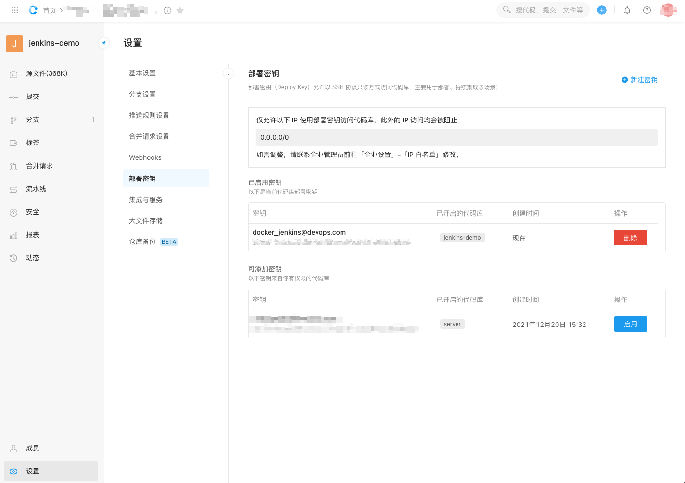

# jenkins 在自动化运维的定位


# docker安装jenkins

1. DockerHub 获取镜像 [jenkins/jenkins ]([jenkins/jenkins - Docker Image | Docker Hub](https://hub.docker.com/r/jenkins/jenkins)) 并安装、启动容器

```shell
docker serach jenkins

docker pull jenkins/jenkins

docker images 

docker run \
  -u root \
  --rm \
  -d \
  --name jenkins-demo-c \
  -p 8080:8080 \
  -p 50000:50000 \
  -v jenkins-data-demo:/var/jenkins_home \
  -v /var/run/docker.sock:/var/run/docker.sock \
  jenkinsci/blueocean
 
docker run \
  -u root \
  --rm \
  -d \
  --name jenkins-demo-c2 \
  -p 8082:8080 \
  -p 50002:50000 \
  -v jenkins-data-demo2:/var/jenkins_home \
  -v /var/run/docker.sock:/var/run/docker.sock \
  jenkinsci/blueocean
  
  
docker ps 
```

2. 安装推荐插件
   
3. 设置用户名/密码 admin/123456

# Jenkins的一些全局配置

- Dashbord > 凭据 > 系统 > 全局凭据 > SSH Username with private key
- docker 容器内 生成rsa非对称密钥, 填入私钥

```shell
ssh-keygen -t rsa -C "docker_jenkins@devops.com"
```

- Codeup 添加公钥,
  

- Dashboard > 全局工具配置

配置JDK


配置maven


## 何时使用 JDK、MAVEN、GIT 工具呢?

流水线语法

```Jenkinsfile
pipeline {
  agent any
  stages {
  
    stage('Build') {
      steps {
        sh 'mvn -version'
        sh 'java -version'
        sh 'mvn -B clean install -Dmaven.test.skip=true'
      }
    }

    stage('Test') {
      steps {
        echo 'start testing'
      }
    }

    stage('Deliver') {
      steps {
        archiveArtifacts '**/target/pmd.xml'
        input 'click yes, finish deliver new project'
      }
    }

  }
  tools {
    maven 'maven-3.8.5'
    jdk 'jdk-1.8'
  }
}

```


# 构建 Docker 镜像

```xml
<plugin>
    <groupId>com.spotify</groupId>
    <artifactId>dockerfile-maven-plugin</artifactId>
    <version>1.4.13</version>
    <executions>
        <execution>
            <id>default</id>
            <goals>
                <goal>build</goal>
                <goal>push</goal>
            </goals>
        </execution>
    </executions>
    <configuration>
        <repository>${project.artifactId}</repository>
        <tag>${project.version}</tag>
        <buildArgs>
            <JAR_FILE>target/${project.build.finalName}.jar</JAR_FILE>
        </buildArgs>
    </configuration>
</plugin>
```


```dockerfile
FROM adoptopenjdk/openjdk8:alpine
MAINTAINER "tinytinycn"
ARG JAR_FILE
ADD ${JAR_FILE} /spring-jenkins-demo.jar
EXPOSE 8888
ENTRYPOINT ["java", "-jar", "/spring-jenkins-demo.jar", "--server.port=8888"]
```

