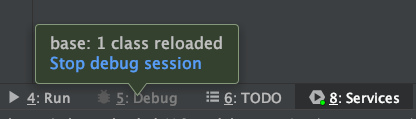

## 1-Springboot devtools 热部署

1. springboot 应用的pom.xml文件引入依赖

```xml

<dependency>
    <groupId>org.springframework.boot</groupId>
    <artifactId>spring-boot-devtools</artifactId>
    <optional>true</optional>
</dependency>
```

2. 配置应用的更新策略

```txt
选择 Run|Eidt Configurations -> 选择 Springboot run Configoration -> 选择 On ‘Update’ action 下拉菜单的相应选项
```

3. debug模式启动应用
4. 编辑代码
5. 按快捷键 cmd+F10 更新应用
   

### 说明：

1. devtools会监听classpath下的文件变动，并且会立即重启应用（发生在保存时机），注意：因为其采用的虚拟机机制，该项重启是很快的。
2. devtools可以实现页面热部署（即页面修改后会立即生效，这个可以直接在application.properties文件中配置spring.thymeleaf.cache=false来实现(这里注意不同的模板配置不一样)。

在修改以下代码都不需要重启服务器：修改类、配置文件、页面文件（原理是将spring.thymeleaf.cache设为false）之后ctrl+s：应用会重启。

如果不能使用的话，以下就几种常见的问题：

1. 对应的spring-boot版本是否正确，这里使用的是1.5.3版本；
2. 是否加入plugin以及属性<fork>true</fork>
3. Eclipse Project 是否开启了Build Automatically（开启自动编译的功能）。
4. 如果设置SpringApplication.setRegisterShutdownHook(false)，则自动重启将不起作用。

最后，这两种方式springloader、devtools只需要配置一种即可，建议使用devtools，可以支持更多的代码热部署。


