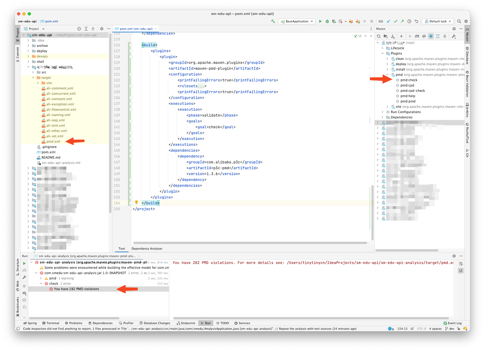
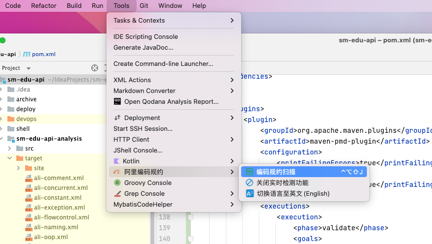

# Maven项目集成 p3c-pmd 阿里巴巴代码规范插件

1. 针对存在父子依赖关系的maven项目, 可以直接在 parent pom.xml 中添加如下配置

```xml
<!-- 属性定义,定义编译环境以及第三方依赖的版本 -->
<properties>
    <!-- 字符编码 -->
    <project.build.sourceEncoding>UTF-8</project.build.sourceEncoding>
    <!-- pmd 静态代码检测 -->
    <maven.pmd.version>3.13.0</maven.pmd.version>
    <p3c.pmd.version>2.0.1</p3c.pmd.version>
</properties>
<build>
    <plugins>
        <!-- 编码规约扫描命令： mvn pmd:pmd-->
        <plugin>
            <groupId>org.apache.maven.plugins</groupId>
            <artifactId>maven-pmd-plugin</artifactId>
            <version>${maven.pmd.version}</version>
            <configuration>
                <printFailingErrors>true</printFailingErrors>
                <rulesets>
                    <ruleset>rulesets/java/ali-comment.xml</ruleset>
                    <ruleset>rulesets/java/ali-concurrent.xml</ruleset>
                    <ruleset>rulesets/java/ali-constant.xml</ruleset>
                    <ruleset>rulesets/java/ali-exception.xml</ruleset>
                    <ruleset>rulesets/java/ali-flowcontrol.xml</ruleset>
                    <ruleset>rulesets/java/ali-naming.xml</ruleset>
                    <ruleset>rulesets/java/ali-oop.xml</ruleset>
                    <ruleset>rulesets/java/ali-orm.xml</ruleset>
                    <ruleset>rulesets/java/ali-other.xml</ruleset>
                    <ruleset>rulesets/java/ali-set.xml</ruleset>
                </rulesets>
                <printFailingErrors>true</printFailingErrors>
            </configuration>
            <executions>
                <!-- 绑定 pmd:check 到 validate 生命周期 -->
                <execution>
                    <phase>validate</phase>
                    <goals>
                        <goal>check</goal>
                    </goals>
                </execution>
            </executions>
            <dependencies>
                <!-- p3c 依赖 -->
                <dependency>
                    <groupId>com.alibaba.p3c</groupId>
                    <artifactId>p3c-pmd</artifactId>
                    <version>${p3c.pmd.version}</version>
                </dependency>
            </dependencies>
        </plugin>
    </plugins>
</build>
```



2. 代码编辑器(IDEA) 安装 Alibaba Java Coding Guidelines 插件, 可以进行代码规范扫描检查





## 参考

- [alibaba-p3c](https://github.com/alibaba/p3c/tree/master/idea-plugin)
- [maven中集成pmd、checkstyle](https://www.jianshu.com/p/557b975ae40d)